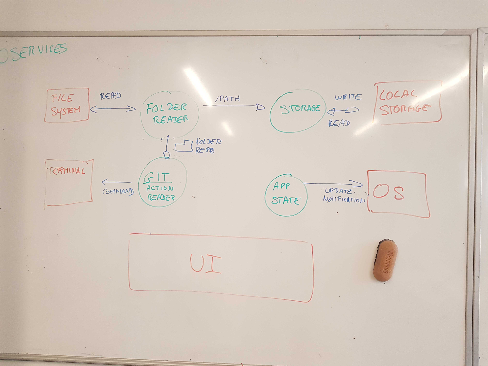

# Unit tests

On CI side

# Git

## Branchs :

`feat/#issueId`

`fix/#issueId`

## Commits :

`feat(buttons): change background`

# Linter / Prettier

pre-commit hook

# Doc

- jsdoc
- folder /doc with mrkdwn

# Last session

